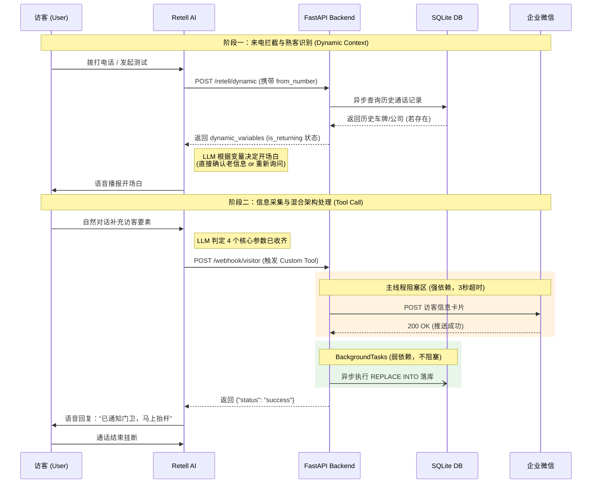

# AI-Gatekeeper: 园区智能门卫语音 Agent


本项目是一个全链路跑通的智能园区门卫语音助手。访客通过电话拨入后，AI 能够以极具拟真度的人声与访客进行自然交互，动态识别历史回访人员，并在完成关键信息（车牌、公司、电话、事由）采集后，实现毫秒级内网穿透推送至企业微信群，全流程无缝衔接。

---

## 🌟 核心特性 (Core Features)

- ⚡ **极速响应 (Sub-25s TTL):** 从电话接通到微信消息发出，全链路控制在 15-20 秒内，彻底告别机械式的一问一答。
- 🧠 **动态回访识别 (Dynamic Context):** 系统接通瞬间拦截来电号码，异步匹配本地访客特征库。老熟人再次来访时，AI 将直接确认历史车牌与事由（“今天还是开沪A8888去鲸鱼科技吗？”），将对话从 4 轮压缩至 1 轮。
- 🛡️ **混合异步架构 (Sync-Async Mixed):** 核心放行通知采用强依赖阻塞（设置严格超时保障业务一致性），历史记录落库采用 FastAPI `BackgroundTasks` 弱依赖后台执行，保障高并发下的极低语音延迟。

---

## 核心业务时序

---
### 技术选型说明 (Technology Stack Justification)
在 7 天的交付周期与“极致拟真”的双重要求下，本项目的选型经过了以下 Trade-off 考量：
Voice Agent 层：Retell AI vs 自建流式架构 (如 Pipecat)
放弃完全自建：虽然自建可以免去 SaaS 费用，但处理 WebRTC 实时流、VAD (人声端点检测) 的打断逻辑以及网络抖动，在短时间内难以达到商用体验。

选择 Retell：它原生支持极低延迟（~800ms）的 TTS/STT 转换。
Backend 层：FastAPI + httpx + aiosqlite
放弃传统 Flask/Requests：在语音实时流场景中，任何 I/O 阻塞（请求微信 API、读写 SQLite）都会导致音频线程挂起，访客会听到明显的卡顿或死寂。

采用全异步：FastAPI 原生支持 asyncio，结合 httpx 和 aiosqlite，确保了 Node.js 级别的高并发吞吐能力。引入了 lifespan 管理数据库初始化，避免了全局副作用。
架构解耦：BackgroundTasks 处理弱依赖
业务一致性与延迟的权衡：如果在收到 AI 的 Tool Call 时，将所有任务（发微信、存数据库）都串行执行，会拖慢 AI 开口的时间；如果全部丢到后台执行，一旦微信 API 宕机，AI 却对访客播报了“已放行”，会导致严重的现场拥堵。
混合解耦：最终采用“强弱依赖分离”。将决定后续业务走向的“微信推送”置于主线程（设置严格超时），将仅用于优化的“特征落库”置于 BackgroundTasks，在保障业务一致性的前提下压榨出了极限延迟。

通知层：企业微信 Webhook
相比于复杂的自建 WebSocket 门卫前端，企微 Webhook 免认证、零风控限制，且最贴合国内真实安保人员的工作习惯，开发成本极低且演示效果直观。

语音链路介入：WebRTC 测试桩 vs 真实 PSTN 网络
   - 痛点： 国内对于语音机器人和 SIP 中继的运营商合规与风控极其严格，申请可双向接听的真实号码（如阿里云/Twilio）需要长周期的企业资质与话术审核，这在 7 天的极限交付周期内是一个不可控的外部阻塞点。
   - 解法 (PoC 解耦)： 放弃死磕真实号码，转而利用 Retell 提供的 WebRTC 通道作为语音流入口。为了在没有真实号码的情况下验证核心的“回访识别”逻辑，我在 FastAPI 接入层编写了专门的 Mock 拦截器。当检测到 `web_call` 时，自动注入测试主叫号码，从而在本地完美模拟并验证了复杂的 RAG 与动态状态机流转。一旦未来取得合规的 SIP 账号，只需移除测试桩即可无缝上线生产环境。

---

## 极速部署指南 (Quick Start)

1. 环境准备
```Bash
git clone 
cd voiceagent
python -m venv .venv
激活环境 (Windows: .\.venv\Scripts\Activate.ps1)
激活环境 (Mac/Linux: source .venv/bin/activate)
pip install -r requirements.txt
```
2. 环境变量 (.env)
在项目根目录创建 .env 文件，填入你的企业微信群机器人 Webhook 地址：
WEBHOOK_URL=[https://qyapi.weixin.qq.com/cgi-bin/webhook/send?key=your-key-here](https://qyapi.weixin.qq.com/cgi-bin/webhook/send?key=your-key-here)

3. 运行服务
```Bash
uvicorn main:app --host 0.0.0.0 --port 8000 --reload
```
4. 公网穿透 (推荐 Pinggy)
由于需接收 Retell 云端回调，需将本地 8000 端口暴露至公网（Windows 下注意绑定 127.0.0.1）：
```Bash
ssh -p 443 -R0:127.0.0.1:8000 a.pinggy.io
```
获取临时 HTTPS 域名后，前往 Retell 后台配置 Dynamic Sync 和 Custom Tool 的 Webhook 即可开始测试。